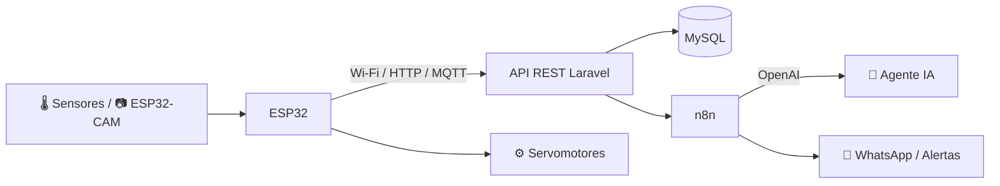

<div align="center">

  <!-- CONTADOR DE VISITAS -->
  <p align="right">
    
  </p>

  <!-- BANNER ANIMADO -->
  

  <!-- ANIMACIÓN DE ESCRITURA -->
  <div>
    <a href="https://git.io/typing-svg">
      
    </a>
  </div>

  <!-- BOTONES SOCIALES (reemplaza los enlaces TU_USUARIO / TU_CORREO) -->
  <p align="center">
    <a href="https://github.com/Saler123" target="_blank">
      
    </a>
    <a href="https://www.linkedin.com/in/sandro-david-juarez-gabino-a9334533a/" target="_blank">
      
    </a>
    <a href="https://www.instagram.com/sandrd_djg/" target="_blank">
      
    </a>
    <a href="https://www.tiktok.com/@yoto0872" target="_blank">
      
    </a>
    <a href="https://wa.me/+51902743580" target="_blank">
      
    </a>
    <a href="mailto:sandroyoto@gmail.com">
      
    </a>
    <a href="#-englobor">
      
    </a>
  </p>

</div>

---

### ⚡ Terminal de Diagnóstico del Sistema

```bash
yoto@sistemas-core:~$ ./diagnostico.sh --modo=completo
================================================================================
>> OPERADOR       : YOTO_IA (Saler123)
>> UBICACIÓN      : Perú 🇵🇪
>> FORMACIÓN      : Estudiante de Ingeniería de Sistemas
>> ROLES          : Dev Full-Stack | Soporte & Infraestructura TI | Redes | IoT Maker
>> MODO           : 🧠 AI-Powered Developer
>> COPILOTOS IA   : ChatGPT • Gemini • Claude • OpenCode
>> MOTOR IA       : OpenAI API + n8n + Agentes de IA + Procesamiento de voz
>> STACK          : TypeScript • PHP/Laravel • Java • Python • C/C++ • React • ESP32
>> DATOS          : MySQL • SQL Server • PostgreSQL • Docker • Power BI
>> RED            : TCP/IP • LAN/WAN • VLAN • Switching • Wi-Fi • CCTV
>> PROYECTO       : ENGLOBOR — seguridad, tecnología, automatización e IA
>> ESTADO         : 🟢 Disponible para proyectos, colaboraciones y oportunidades
================================================================================
```

---

### 💡 Sobre mí

> *"Creo soluciones que combinan software, automatización, inteligencia artificial, IoT e infraestructura para resolver problemas reales y optimizar procesos."*

🎓 **Estudiante de Ingeniería de Sistemas** con experiencia en **soporte técnico, infraestructura TI, redes y desarrollo de software**.

- 💻 **Desarrollo de software**: plataformas SaaS con Laravel, PHP, JavaScript y MySQL.
- 🤖 **IA & Automatización**: agentes inteligentes, chatbots, integración con WhatsApp y flujos en n8n con OpenAI API.
- 🔌 **IoT & Hardware**: ESP32, ESP32-CAM, sensores, servomotores y sistemas de monitoreo.
- 🌐 **Redes & Infraestructura**: diseño, diagnóstico y optimización de redes empresariales, VLAN, cableado estructurado y CCTV.
- 🚀 **Emprendimiento**: construyendo **ENGLOBOR**, enfocado en seguridad, tecnología, automatización e IA.

---

### 🌟 Proyectos destacados

<div align="center">

<table>
  <tr>
    <td width="50%" align="center">
      <br>
      <b>🏢 SaaS de gestión empresarial</b>
      <p align="left">Plataforma web multiempresa para gestión de negocios y reservas (ChiraFlow), con paneles administrativos, roles y base de datos relacional.</p>
      <code>Laravel</code> • <code>PHP</code> • <code>JavaScript</code> • <code>MySQL</code>
    </td>
    <td width="50%" align="center">
      <br>
      <b>🤖 Automatización con IA</b>
      <p align="left">Agentes inteligentes y chatbots conectados a WhatsApp y APIs externas, orquestados con flujos de n8n y procesamiento de voz.</p>
      <code>OpenAI API</code> • <code>n8n</code> • <code>WhatsApp</code> • <code>APIs REST</code>
    </td>
  </tr>
  <tr>
    <td width="50%" align="center">
      <br>
      <b>🔌 Sistemas IoT & Monitoreo</b>
      <p align="left">Comedero inteligente con ESP32-CAM y nube, robot mini, detección de caras con ESP32, sensores, servomotores y cámaras de monitoreo.</p>
      <code>ESP32</code> • <code>ESP32-CAM</code> • <code>Sensores</code> • <code>Servos</code>
    </td>
    <td width="50%" align="center">
      <a href="https://github.com/Saler123/ESP32-OLED-Video-Converter" target="_blank">
        <br>
        <b>📺 Video → Animación OLED</b>
      </a>
      <p align="left">Convierte videos en animaciones para pantallas OLED 128x64 controladas con ESP32.</p>
      <code>ESP32</code> • <code>OLED SSD1306</code> • <code>JavaScript</code>
    </td>
  </tr>
  <tr>
    <td width="50%" align="center">
      <br>
      <b>🌐 Infraestructura de redes</b>
      <p align="left">Diseño, diagnóstico y optimización de redes empresariales: switches, VLAN, Wi-Fi, cableado estructurado y CCTV.</p>
      <code>Cisco</code> • <code>VLAN</code> • <code>UniFi</code> • <code>CCTV</code>
    </td>
    <td width="50%" align="center" id="-englobor">
      <br>
      <b>🚀 ENGLOBOR</b>
      <p align="left">Proyecto empresarial enfocado en soluciones de seguridad, tecnología, automatización e inteligencia artificial.</p>
      <code>Seguridad</code> • <code>Automatización</code> • <code>IA</code> • <code>IoT</code>
    </td>
  </tr>
</table>

</div>

---

### 📂 Inmersiones profundas y planos de ingeniería

<details>
<summary><b>🔌 [EXPANDIR] Arquitectura IoT: del sensor a la nube</b></summary>
<br>



* **Captura**: sensores y cámaras conectados a ESP32 / ESP32-CAM.
* **Control**: actuadores y servomotores para automatizar tareas (ej. comedero inteligente).
* **Nube**: envío de datos a una API propia y almacenamiento en MySQL.
* **Inteligencia**: flujos n8n que analizan eventos con IA y notifican por WhatsApp.

</details>

<details>
<summary><b>🌐 [EXPANDIR] Laboratorio de redes e infraestructura</b></summary>
<br>

| Área | Conocimientos |
| :--- | :--- |
| 🧱 **Fundamentos** | Modelo OSI, TCP/IP, subnetting, LAN / WAN |
| 🔀 **Switching** | VLAN, trunking, configuración de switches gestionables |
| 📡 **Routing & Wi-Fi** | Routers, redes inalámbricas, Ubiquiti UniFi |
| 🔌 **Capa física** | Cableado estructurado, certificación y organización de racks |
| 📹 **Seguridad física** | Instalación y configuración de sistemas CCTV |
| 🧪 **Simulación** | Cisco Packet Tracer, VirtualBox, Advanced IP Scanner |

</details>

<details>
<summary><b>🛠️ [EXPANDIR] Arsenal de hardware y laboratorio de desarrollo</b></summary>
<br>

* **Microcontroladores**: ESP32, ESP32-CAM, Arduino UNO / Mega.
* **Actuadores**: servomotores, motores DC, relés.
* **Sensores**: temperatura, humedad, ultrasonido, movimiento, cámaras.
* **Pantallas**: OLED SSD1306 128x64.
* **Software**: VS Code, Arduino IDE, PlatformIO, Postman, Microsoft Visio, Cisco Packet Tracer.

</details>

---

### 🧠 AI-Powered Developer

> *"La creatividad humana potenciada por la inteligencia artificial."*

Uso asistentes de IA como copilotos en mi día a día para **programar más rápido, depurar, diseñar arquitecturas, documentar y aprender** nuevas tecnologías — siempre entendiendo y validando el código que construyo.

<div align="center">

  
  
  
  

</div>

| Herramienta | Cómo la uso |
| :--- | :--- |
| 💬 **ChatGPT** | Lluvia de ideas, explicaciones, prompts y prototipos rápidos |
| ✨ **Gemini** | Investigación, análisis de documentos y apoyo multimodal |
| 🧡 **Claude** | Desarrollo de código, refactorización y proyectos completos |
| ⌨️ **OpenCode** | Agente de programación en terminal para automatizar tareas de desarrollo |

---

### 🛠️ Stack tecnológico y caja de herramientas

<div align="center">

  <a href="https://skillicons.dev">
    
  </a>

  <br><br>

  <p align="center">
    
    
    
    
    
    
    
    
    
    
    
    
    
    
  </p>

</div>

---

### 🎯 Actualmente

- 📚 Estudiando **Ingeniería de Sistemas**
- 💻 Desarrollando proyectos de software
- 🤖 Explorando Inteligencia Artificial y automatización
- 🌐 Profundizando en redes e infraestructura TI
- 🔌 Desarrollando soluciones IoT
- 🚀 Construyendo proyectos tecnológicos propios

**Intereses profesionales:** `Software Development` · `IT Infrastructure` · `Networking` · `Automation` · `Artificial Intelligence` · `IoT` · `Cybersecurity`

---

### 📈 Estadísticas y actividad en GitHub

<div align="center">

  <!-- Calculado sobre TODOS los repos (incluye privados): python scripts/lenguajes.py -->
  

  <br><br>

  

  <br>

  

</div>

---

<div align="center">
  
</div>
